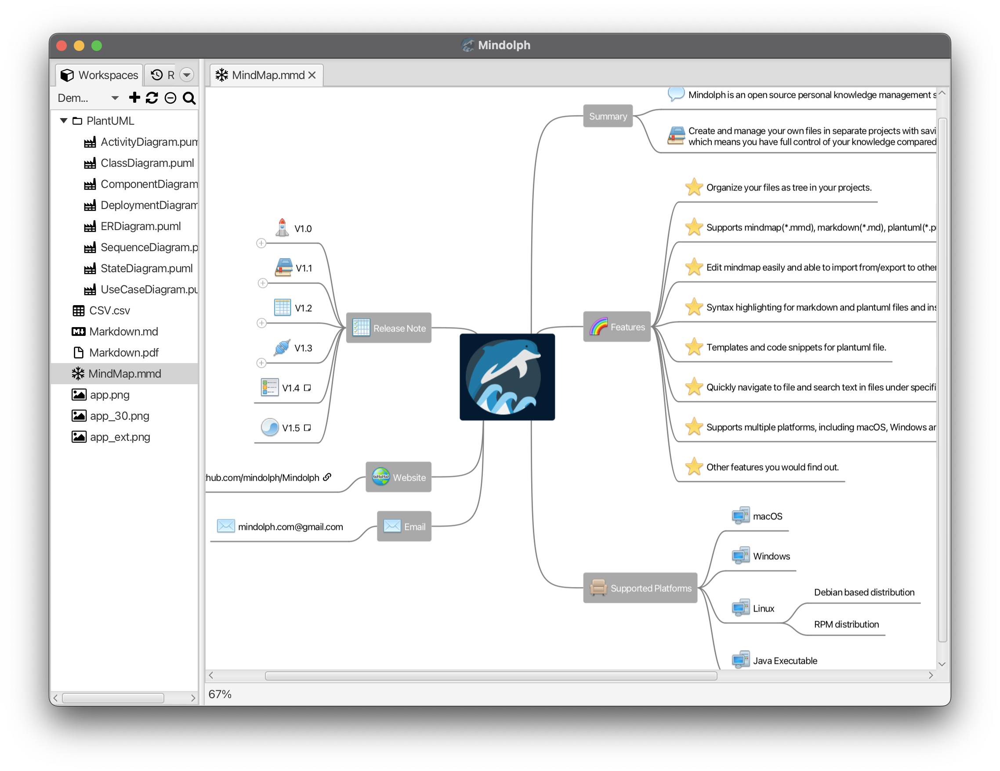
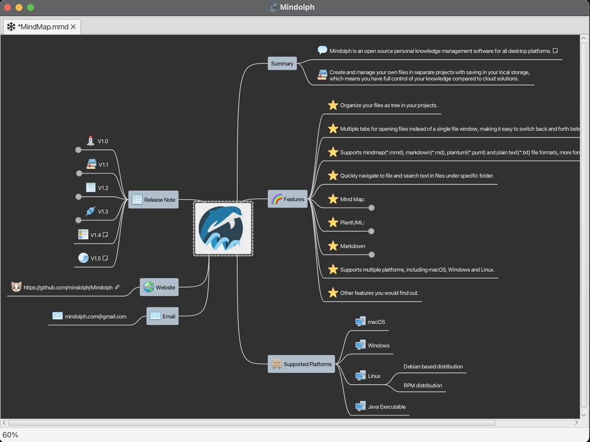
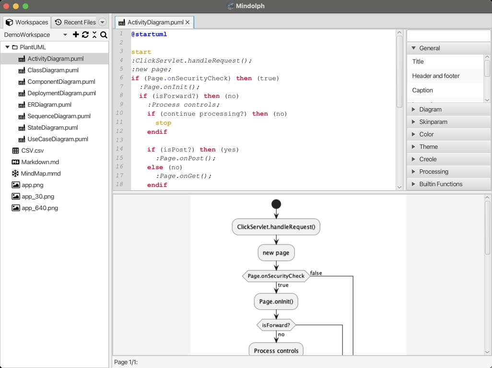

### Mindolph

Mindolph is an open source personal knowledge management software for all desktop platforms. [简体中文](./docs/README_zh_CN.md)

### Features
* Create and manage your own files in separate workspaces with saving in your local storage, which means you have full control of your knowledge compared to cloud solutions.
* Organize your files as tree in your workspaces.
* Multiple tabs for opening files instead of a single file window, making it easy to switch back and forth between files.
* Supports Mind Map(`*.mmd`), Markdown(`*.md`), PlantUML(`*.puml`), CSV sheet(`*.csv`) and plain text(`*.txt`) file formats, more formats will be supported in the future.
* Quickly navigate to file and search text in files under specific folder.
* Mind Map:
	* Edit mind map easily and quickly with key shortcuts.
	* Supports theme and provides some pre-defined themes(`Classic`, `Light` and `Dark`), customizing themes by duplicating existing theme and setup style of any element freely.
	* Supports note, file link, URI link, image and emoticon for topic node. 
	* Import from other mind map formats like Freemind, Mindmup, XMind, Coggle, Novamind.
	* Export to other file formats like Freemind, Markdown, image file(png/svg), AsciiDoc, etc.
	* Compatible with files created by `netbeans-mmd-plugin`.
* PlantUML:
	* Syntax highlighting.
	* Preview result instantly while editing.
	* Templates and code snippets for editing quickly.
	* Export to image file and ascii image.
* Markdown
	* Syntax highlighting.
	* Preview result instantly while editing.
	* Export to PDF and HTML file.
* CSV Sheet
	* Show and edit csv file visually.
* Supports multiple desktop platforms, including `macOS`, `Windows` and `Linux`.
* Many other features you would find out.

### Screenshots

	
	&nbsp;&nbsp;&nbsp;&nbsp;
	

	
	&nbsp;&nbsp;&nbsp;&nbsp;
	

	
	&nbsp;&nbsp;&nbsp;&nbsp;
	

	
	&nbsp;&nbsp;&nbsp;&nbsp;
	

[See More](docs/screenshots.md)

### Releases

|Platform|Type|Stable|Unstable|Note|
|----|----|----|----|----|
|Release Notes| |[v1.5.x](docs/release-notes/v1.5/v1.5.md)|[v1.6.x](docs/release-notes/v1.6/v1.6.md)| |
|MacOS|.dmg|[v1.5.9](https://github.com/mindolph/Mindolph/releases/download/v1.5.9/Mindolph-1.5.9.dmg) |[v1.6.9](https://github.com/mindolph/Mindolph/releases/download/v1.6.9/Mindolph-1.6.6.dmg) | |
|Windows|.msi|[v1.5.9](https://github.com/mindolph/Mindolph/releases/download/v1.5.9/Mindolph-1.5.9.msi) |[v1.6.9](https://github.com/mindolph/Mindolph/releases/download/v1.6.9/Mindolph-1.6.6.msi) | |
|Debian|.deb|[v1.5.9](https://github.com/mindolph/Mindolph/releases/download/v1.5.9/Mindolph-1.5.9.deb)|[v1.6.9](https://github.com/mindolph/Mindolph/releases/download/v1.6.9/Mindolph-1.6.6.deb)|	for supporting PlantUML, install graphviz first:   `sudo apt install graphviz`|
|Fedora|.rpm|[v1.5.9](https://github.com/mindolph/Mindolph/releases/download/v1.5.9/Mindolph-1.5.9.rpm)|[v1.6.9](https://github.com/mindolph/Mindolph/releases/download/v1.6.9/Mindolph-1.6.6.rpm)| |
|Java Executable|.jar|[v1.5.9](https://github.com/mindolph/Mindolph/releases/download/v1.5.9/Mindolph-1.5.9.jar)|[v1.6.9](https://github.com/mindolph/Mindolph/releases/download/v1.6.9/Mindolph-1.6.6.jar)| Java 17 is the minimum version to run this application. 	  If you are using Linux, run the jar like this:    `java -jar Mindolph-1.5.9.jar`    If not, Download latest JavaFX SDK for your platform and extract to somewhere eg: `c:\javafx-sdk-21`, run the jar file like this:     `java --module-path c:\javafx-sdk-21\lib --add-modules  java.sql,javafx.controls,javafx.fxml,javafx.swing,javafx.web -jar  Mindolph-1.5.9.jar` |

[Change Logs](docs/change_logs.md)

### Development

Mindolph is developed based on JavaFX, 
see [code/README.md](code/README.md) for more details.

Future Plan:  
* 1.7: Experimental GenAI support.
* 1.8: Improvement and refactor.

