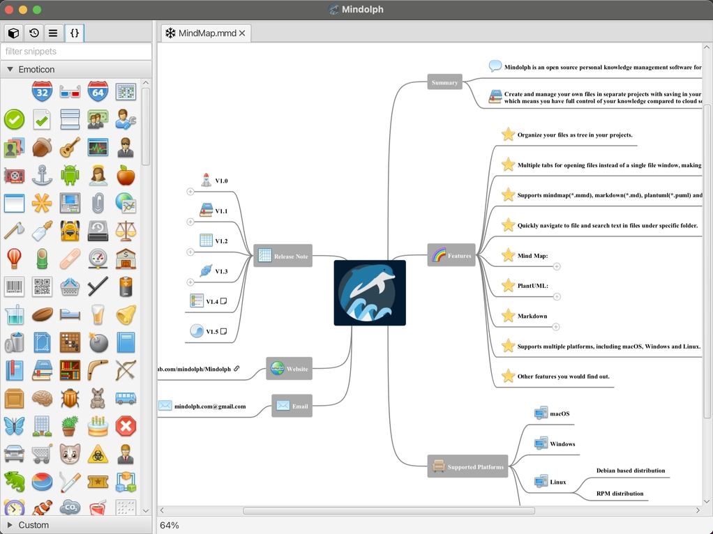
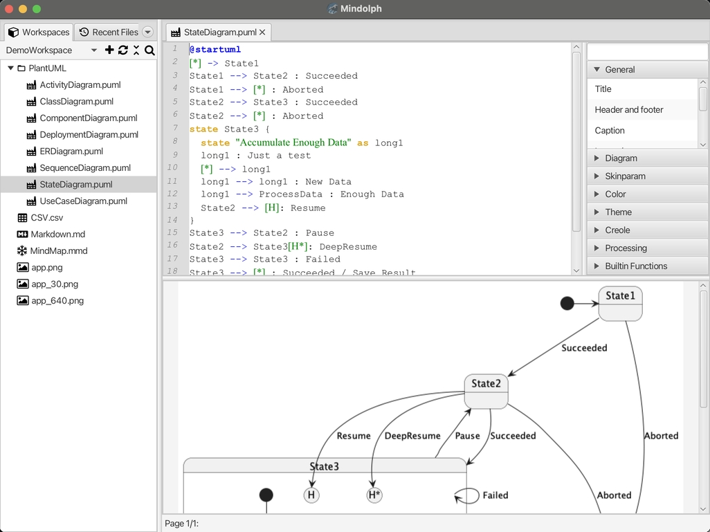

	
	
	
	

### Mindolph

Mindolph is an open source personal knowledge management software for all desktop platforms. [简体中文](./docs/README_zh_CN.md)

### Features
* Create and manage your own files in separate workspaces with saving in your local storage, which means you have full control of your knowledge compared to cloud solutions.
* Organize your files as a tree in your workspaces.
* Save opened files  as a named `Collection` to manage related files even from different workspaces.
* Multiple tabs for opening files instead of a single file window, making it easy to switch back and forth between files.
* Supports Mind Map(`*.mmd`), Markdown(`*.md`), PlantUML(`*.puml`), CSV sheet(`*.csv`) and plain text(`*.txt`) file formats, more formats will be supported in the future.
* Outline view for active opened file.
* Snippet feature to quickly insert pre-defined or user-defined snippets to Mind Map, PlantUML and Markdown files.
* Quickly navigate to any file and search text in files under any specific folder.
* Mind Map:
	* Edit mind map easily and quickly with key shortcuts.
	* Supports themes and provides some pre-defined themes(`Classic`, `Light` and `Dark`), customizing themes by duplicating existing themes and setup the style of any element freely.
	* Supports note, file link, URI link, image and emoticon for topic node.
	* Import from other mind map formats like Freemind, Mindmup, XMind, Coggle, Novamind.
	* Export to other file formats like Freemind, Markdown, image files(png/svg), AsciiDoc, etc.
	* Compatible with files created by `netbeans-mmd-plugin`.
* PlantUML:
	* Syntax highlighting.
	* Preview results instantly while editing.
	* Export to image file and ASCII image.
* Markdown
	* Syntax highlighting.
	* Preview results instantly while editing.
	* Export to PDF and HTML files.
* CSV Sheet
	* Show and edit CSV file visually.
* Experimental GenAI support for Mind Map, Markdown, PlantUML and plain text editors, you can generate text content by API of LLM. supported LLM providers:
	* OpenAI  
	* Ali Qwen  
	* Ollama  
	* Google Gemini API  
	* Hugging Face API  
	* ChatGLM  
	* DeepSeek
* Supports multiple desktop platforms, including `macOS`, `Windows` and `Linux`.
* Many other features you would find out.

### Screenshots

	
	&nbsp;&nbsp;&nbsp;&nbsp;
	

	
	&nbsp;&nbsp;&nbsp;&nbsp;
	

	
	&nbsp;&nbsp;&nbsp;&nbsp;
	

	
	&nbsp;&nbsp;&nbsp;&nbsp;
	

[See More](docs/screenshots.md)

### Releases

#### Release Notes

* Stable Version: [v1.10.x](docs/release-notes/v1.10/v1.10.md)
* Unstable Version: [v1.11.x](docs/release-notes/v1.11/v1.11.md)

#### Downloads

|Platform|Type|Stable|Unstable|Note|
|----|----|----|----|----|
|macOS|.dmg|[v1.10.5](https://github.com/mindolph/Mindolph/releases/download/v1.10.5/Mindolph-1.10.5-x64.dmg) |[v1.11.5](https://github.com/mindolph/Mindolph/releases/download/v1.11.5/Mindolph-1.11.5-x64.dmg) | Intel |
|macOS|.dmg|[v1.10.5](https://github.com/mindolph/Mindolph/releases/download/v1.10.5/Mindolph-1.10.5-aarch64.dmg) |[v1.11.5](https://github.com/mindolph/Mindolph/releases/download/v1.11.5/Mindolph-1.11.5-aarch64.dmg) | Apple Silicon  for supporting PlantUML, install graphviz first: `brew install graphviz`|
|Windows|.msi|[v1.10.5](https://github.com/mindolph/Mindolph/releases/download/v1.10.5/Mindolph-1.10.5.msi) |[v1.11.5](https://github.com/mindolph/Mindolph/releases/download/v1.11.5/Mindolph-1.11.5.msi) | |
|Debian/Ubuntu|.deb|[v1.10.5](https://github.com/mindolph/Mindolph/releases/download/v1.10.5/Mindolph-1.10.5.deb)|[v1.11.5](https://github.com/mindolph/Mindolph/releases/download/v1.11.5/Mindolph-1.11.5.deb)|	for supporting PlantUML, install graphviz first:   `sudo apt install graphviz`|
|Fedora|.rpm|[v1.10.5](https://github.com/mindolph/Mindolph/releases/download/v1.10.5/Mindolph-1.10.5.rpm)|[v1.11.5](https://github.com/mindolph/Mindolph/releases/download/v1.11.5/Mindolph-1.11.5.rpm)| |
|Java Executable|.jar|[v1.10.5](https://github.com/mindolph/Mindolph/releases/download/v1.10.5/Mindolph-1.10.5.jar)|[v1.11.5](https://github.com/mindolph/Mindolph/releases/download/v1.11.5/Mindolph-1.11.5.jar)| Java 21 is the minimum version to run this application. 	  If you are using Linux, run the jar like this:    `java -jar Mindolph-1.10.5.jar`    If not, download latest JavaFX SDK for your platform and extract to somewhere eg: `c:\javafx-sdk-23`, run the jar file like this:     `java --module-path c:\javafx-sdk-23\lib --add-modules  java.sql,javafx.controls,javafx.fxml,javafx.swing,javafx.web,jdk.crypto.ec -jar  Mindolph-1.10.5.jar` |

[Change Logs](docs/change_logs.md)

### Development

Mindolph is developed based on JavaFX, see [code/README.md](code/README.md) for more details.

Future Plan:  

* 1.11: New features and improvements for Gen-AI.
* 1.12: Improvement and bug fixing.

### Buy me a cup of coffee

