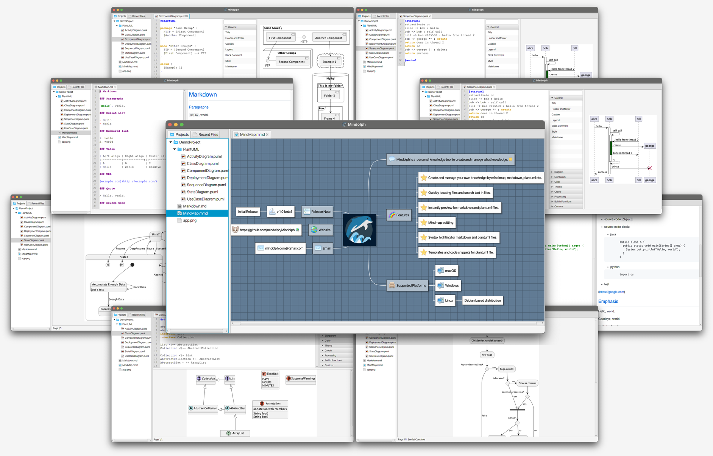

### Mindolph

Mindolph 是一个支持多平台的开源的个人知识库管理软件。[English](../README.md)

### 功能
* 可以创建多个工作空间来管理您的文件。并且文件保存在您本机的存储上，相较于基于云的方案，您拥有对它们完全的掌控。
* 工作空间采用树形目录结构来组织文件。
* 多标签页打开文件而不是单文件窗口，可以方便的在多个文件之间来回切换。
* 支持思维导图(`*.mmd`), Markdown(`*.md`), PlantUML(`*.puml`), CSV 表格(`*.csv`) 以及纯文本(`*.txt`)等多种文件格式，后续还会支持更多格式。
* Markdown 和 PlantUML 代码编辑器语法高亮和即时预览功能。  
* 快速导航并打开文件，以及在任意文件夹下搜索包含指定内容的文件。  
* 思维导图:
	* 支持快捷键可以轻松的编辑思维导图。
	* 可以自由的设定思维导图各元素的样式。
	* 支持导图中添加备注，文件链接，网页链接，图片和表情符号。
	* 支持从其他格式的思维导图文件导入，包括： Freemind, Mindmup, XMind, Coggle, Novamind.
	* 导出至其他文件格式，包括：Freemind, Markdown, AsciiDoc, png/svg 图片等。
* PlantUML:
	* 编辑时实时的预览结果。
	* 模版和代码片段助手帮助您快速的输入。
	* 导出成 jpg 图片或 ascii 图。
* Markdown
	* 编辑时实时的预览结果。
	* 导出成 PDF 或 HTML 文件。
* CSV 表格
	* 可视化显示和编辑 csv 文件。
* 支持多种桌面操作系统，包括 `macOS`, `Windows` 和 `Linux`.
* 其他各种功能。

> Mindolph 的灵感来自于 `netbeans-mmd-plugin` 项目, 但是 Mindolph 是基于 JavaFX 开发的并提供更多增强的功能，方便您轻松编辑和管理您的知识。

### 界面

[更多](screenshots.md)

### 安装

|系统|类型|稳定版|不稳定版|备注|
|----|----|----|----|----|
|MacOS|.dmg|[v1.3.6](https://github.com/mindolph/Mindolph/releases/download/v1.3.6/Mindolph-1.3.6.dmg)|[v1.4.0](https://github.com/mindolph/Mindolph/releases/download/v1.4.0/Mindolph-1.4.0.dmg)| |
|Windows|.msi|[v1.3.6](https://github.com/mindolph/Mindolph/releases/download/v1.3.6/Mindolph-1.3.6.dmg)|[v1.4.0](https://github.com/mindolph/Mindolph/releases/download/v1.4.0/Mindolph-1.4.0.msi)| |
|Debian|.deb|[v1.3.6](https://github.com/mindolph/Mindolph/releases/download/v1.3.6/Mindolph-1.3.6.deb)|[v1.4.0](https://github.com/mindolph/Mindolph/releases/download/v1.4.0/Mindolph-1.4.0.deb)|	显示 PlantUML 图需要先安装 graphviz:     `sudo apt install graphviz`|
|Fedora|.rpm|[v1.3.6](https://github.com/mindolph/Mindolph/releases/download/v1.3.6/Mindolph-1.3.6.rpm)|[v1.4.0](https://github.com/mindolph/Mindolph/releases/download/v1.4.0/Mindolph-1.4.0.rpm)| |
|Java Executable|.jar|[v1.3.6](https://github.com/mindolph/Mindolph/releases/download/v1.3.6/Mindolph-1.3.6.jar)|[v1.4.0](https://github.com/mindolph/Mindolph/releases/download/v1.4.0/Mindolph-1.4.0.jar)| Java 17 是运行 Mindolph 的最低版本要求.   	  如果您在 Linux 上运行:     `java -jar Mindolph-1.3.6.jar`    如果是其他系统, 先下载支持您的系统的 JavaFX SDK 并解压缩到某个目录，例如: `c:\javafx-sdk-20`, 按照以下方式运行:      `java --module-path c:\javafx-sdk-20\lib --add-modules java.sql,javafx.controls,javafx.fxml,javafx.swing,javafx.web -jar  Mindolph-1.3.6.jar` |

[发布历史](release_notes.md)

### 开发

[code/README.md](../code/README.md)
