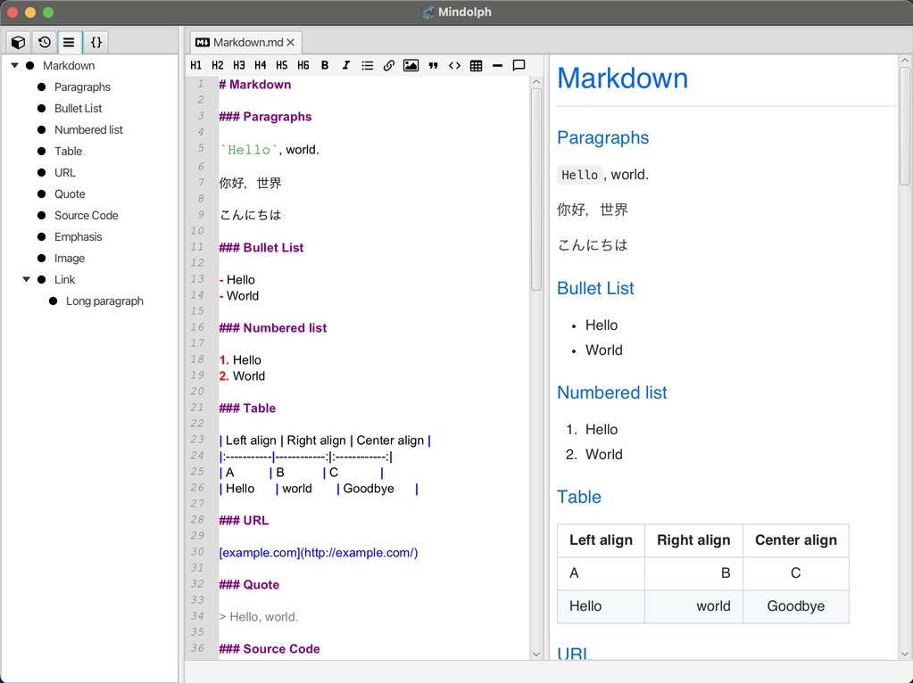
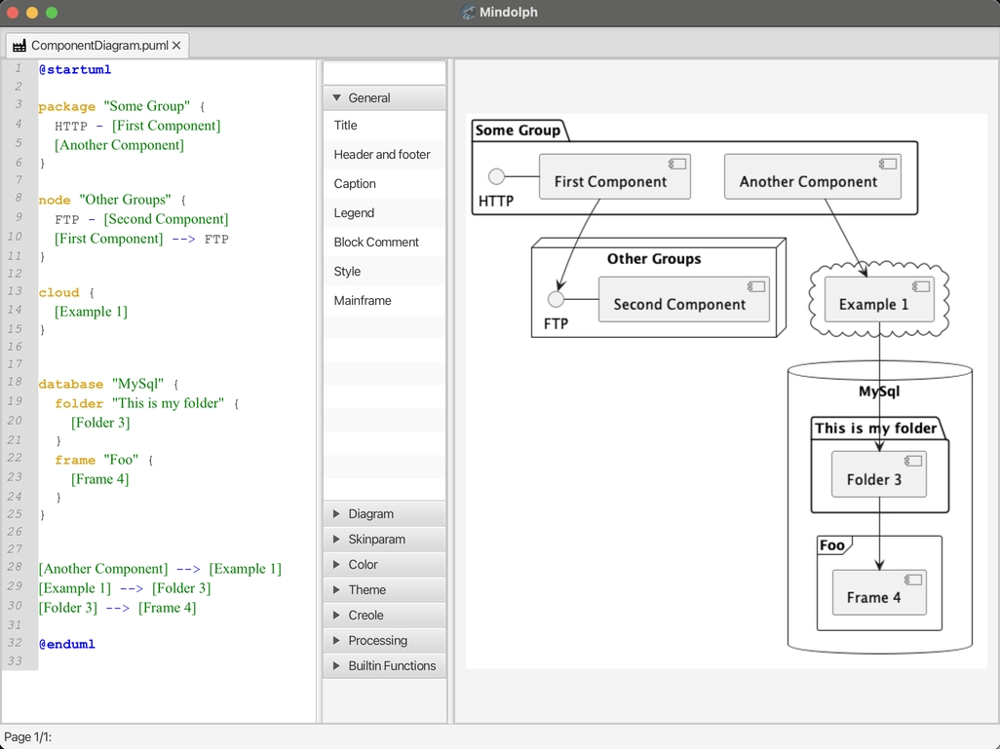

	
	
	
	

### Mindolph

Mindolph 是一个开源的支持多种桌面平台的个人知识库管理软件。[English](../README.md)

### 功能
* 可以创建多个工作空间来管理您的文件。并且文件保存在您本机的存储上，相较于基于云的方案，您拥有对它们完全的掌控。
* 工作空间采用树形目录结构来组织文件。
* 可以把打开的文件保存为一个集合（`Collection`），哪怕文件位于不同的工作空间。
* 多标签页打开文件而不是单文件窗口，可以方便的在多个文件之间来回切换。
* 支持思维导图(`*.mmd`), Markdown(`*.md`), PlantUML(`*.puml`), CSV 表格(`*.csv`) 以及纯文本(`*.txt`)等多种文件格式，后续还会支持更多格式。
* 支持文件大纲视图。
* 全局的代码片段功能，快速插入预定义或自定义的代码片段，支持思维导图，PlantUML和Markdown文件。
* 快速导航并打开文件，以及在任意文件夹下搜索包含指定内容的文件。
* 思维导图:
	* 支持快捷键可以轻松的编辑思维导图。
	* 支持主题并提供了预定义的主题 (`Classic`, `Light` 和 `Dark`)，通过复制已有的主题并自由的设定思维导图各元素的样式来定制主题。
	* 支持导图中添加备注，文件链接，网页链接，图片和表情符号。
	* 支持从其他格式的思维导图文件导入，包括： Freemind, Mindmup, XMind, Coggle, Novamind.
	* 导出至其他文件格式，包括：Freemind, Markdown, AsciiDoc, png/svg 图片等。
	* 与 `netbeans-mmd-plugin` 创建的文件兼容。
* PlantUML:
	* 语法高亮。
	* 编辑时实时的预览结果。
	* 导出成 jpg 图片或 ascii 图。
* Markdown
	* 语法高亮。
	* 编辑时实时的预览结果。
	* 导出成 PDF 或 HTML 文件。
* CSV 表格
	* 可视化显示和编辑 csv 文件。
* 实验性的 Gen-AI 支持，你可以通过大模型的 API 来生成文本内容，支持思维导图, Markdown，PlantUML 和纯文本编辑器。支持的大语言模型:  
	* OpenAI  
	* 阿里通义千问  
	* Ollama  
	* Google Gemini API  
	* Hugging Face API  
	* ChatGLM  
* 支持多种桌面操作系统，包括 `macOS`, `Windows` 和 `Linux`.
* 其他各种功能。

### 界面

	
	&nbsp;&nbsp;&nbsp;&nbsp;
	

	
	&nbsp;&nbsp;&nbsp;&nbsp;
	

	
	&nbsp;&nbsp;&nbsp;&nbsp;
	

	
	&nbsp;&nbsp;&nbsp;&nbsp;
	

[更多](screenshots.md)

### 安装

#### 发行说明

* 稳定版: [v1.10.x](release-notes/v1.10/v1.10_zh_CN.md)  

* 试用版: [v1.11.x](release-notes/v1.11/v1.11_zh_CN.md)  

#### 下载

|系统|类型|稳定版|不稳定版|备注|
|----|----|----|----|----|
|macOS|.dmg|[v1.10.5](https://github.com/mindolph/Mindolph/releases/download/v1.10.5/Mindolph-1.10.5-x64.dmg)|[v1.11.5](https://github.com/mindolph/Mindolph/releases/download/v1.11.5/Mindolph-1.11.5-x64.dmg)| Intel |
|macOS|.dmg|[v1.10.5](https://github.com/mindolph/Mindolph/releases/download/v1.10.5/Mindolph-1.10.5-aarch64.dmg) |[v1.11.5](https://github.com/mindolph/Mindolph/releases/download/v1.11.5/Mindolph-1.11.5-aarch64.dmg) | Apple Silicon  显示 PlantUML 图需要先安装 graphviz: `brew install graphviz`|
|Windows|.msi|[v1.10.5](https://github.com/mindolph/Mindolph/releases/download/v1.10.5/Mindolph-1.10.5.msi)|[v1.11.5](https://github.com/mindolph/Mindolph/releases/download/v1.11.5/Mindolph-1.11.5.msi)| |
|Debian/Ubuntu|.deb|[v1.10.5](https://github.com/mindolph/Mindolph/releases/download/v1.10.5/Mindolph-1.10.5.deb)|[v1.11.5](https://github.com/mindolph/Mindolph/releases/download/v1.11.5/Mindolph-1.11.5.deb)|	显示 PlantUML 图需要先安装 graphviz:     `sudo apt install graphviz`|
|Fedora|.rpm|[v1.10.5](https://github.com/mindolph/Mindolph/releases/download/v1.10.5/Mindolph-1.10.5.rpm)|[v1.11.5](https://github.com/mindolph/Mindolph/releases/download/v1.11.5/Mindolph-1.11.5.rpm)| |
|Java Executable|.jar|[v1.10.5](https://github.com/mindolph/Mindolph/releases/download/v1.10.5/Mindolph-1.10.5.jar)|[v1.11.5](https://github.com/mindolph/Mindolph/releases/download/v1.11.5/Mindolph-1.11.5.jar)| Java 21 是运行 Mindolph 的最低版本要求.   	  如果您在 Linux 上运行:     `java -jar Mindolph-1.10.5.jar`    如果是其他系统, 先下载支持您的系统的 JavaFX SDK 并解压缩到某个目录，例如: `c:\javafx-sdk-23`, 按照以下方式运行:      `java --module-path c:\javafx-sdk-23\lib --add-modules java.sql,javafx.controls,javafx.fxml,javafx.swing,javafx.web,jdk.crypto.ec -jar  Mindolph-1.10.5.jar` |

[版本日志](change_logs.md)

### 开发
Mindolph 是基于 JavaFX 开发的, 更多详情请点击[code/README.md](../code/README.md)

计划:

* 1.11：新的生成式AI功能和改进。
* 1.12：功能改进和bug修复。

### 给我买杯咖啡吧

