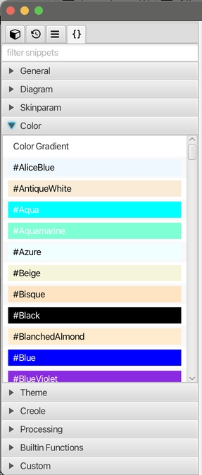
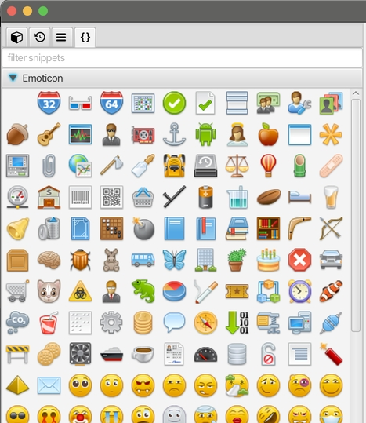
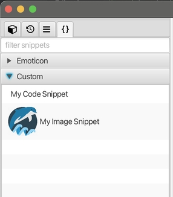
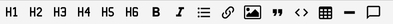
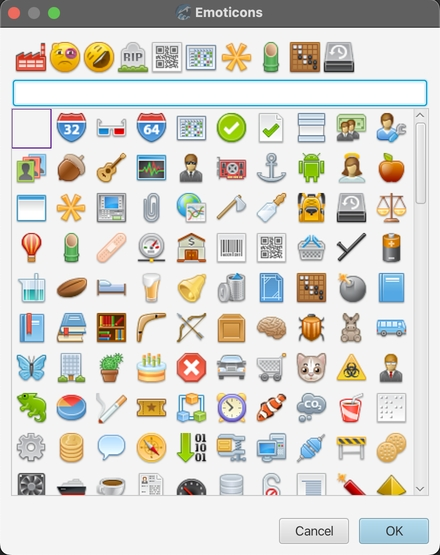

# v1.10 Release Note

### New Features

* new snippet feature in left panel for all files.

* move PlantUML snippets to the global snippet panel.

	  

* add snippet support for Mind Map by emoticons.

	  

* new custom snippet feature for Mind Map, PlantUML and Markdown. You can define your own text or image snippets, the image type snippet can be applied to Mind Map as image attribute without file link.

	  

* new toolbar button to quickly insert comment for Markdown editor

	  

### Improvement

* refactored the emoticon dialog with new emoticon view.

	  

* add option `open topic attributes by double clicking` for mind map and take selected as default.

* ask for a new file name before cloning a file.

### Bug Fixes

* locating folder from `go to file` dialog doesn't work if `auto select` option is disabled by user.

* option `show collapsator when mouse hover` for Mind Map theme.

* no file is created when creating a new file with a path separator.

### Dependencies

* update bundled JRE to 23.0.1  

* update other dependencies like PlantUML, RichTextFX, etc.

---
> Created at 2024-11-12 00:59:13
