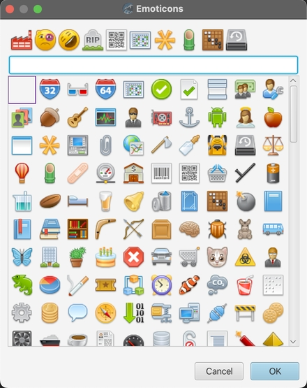

# v1.10 发行说明

### 新功能

* 代码片段

	在左侧面板中为所有文件新增片段功能。你可以将预定义的代码片段插入到打开的文件当中去，也可以自定义片段。

	* 为思维导图新增表情图标的片段支持。

		  

	* 将 PlantUML 代码片段界面移动到统一的全局代码片段面板。

		  

	* 为思维导图、PlantUML 和 Markdown 新增自定义片段功能。你可以定义自己的文本或图片片段，图片类型的片段可以作为图片属性应用到思维导图中，而无需文件链接。

		  

* 新的快速插入 Markdown 注释的工具栏按钮。

	  

### 改进

* 改进了 Markdown 编辑器编辑时预览自动滚动效果，现在滚动同步更加顺滑了. 😊

* 使用 Markdown 编辑器工具栏中的标题按钮时自动删除项目符号前缀（如果存在的话）。

* 优化了使用ESC关闭Gen-AI输入对话框。

* 重构思维导图中的表情图标对话框视图。

	  

* 思维导图新增`open topic attributes by double clicking`选项用来设置是否通过双击打开主题属性，默认为选中。

* 克隆一个文件之前询问新文件名。

### Bug修复

* 从其他选项卡切换到从“在文件中查找”打开的文件选项卡时，会自动错误地选择文件中的搜索关键字。

* 无法打开集合中的文件，因为它们的名称已更改或已移动到另一个文件夹。

* CSV 编辑器不会通过搜索自动滚动到选定的行。

* 单击 Markdown 预览面板中的网络链接应该跳转到外部浏览器。

* 如果用户禁用了 `auto select` 选项，从`go to file`定位文件夹不能正常工作。

* 思维导图主题的`show collapsator when mouse hover`选项无效。

* 创建文件时如果输入带有路径分隔符，文件没有被创建。

* .deb 安装包基于 Debian 12 构建，解决在 Debian 上安装报错的问题，同时也能在 Ubuntu上安装。

### 依赖升级

* 捆绑的 JRE 升级到 23.0.2  

* 升级 JavaFX 到 23.0.2

* 升级其他依赖例如：PlantUML, RichTextFX 等等。

---
> Created at 2024-11-12 00:59:23
