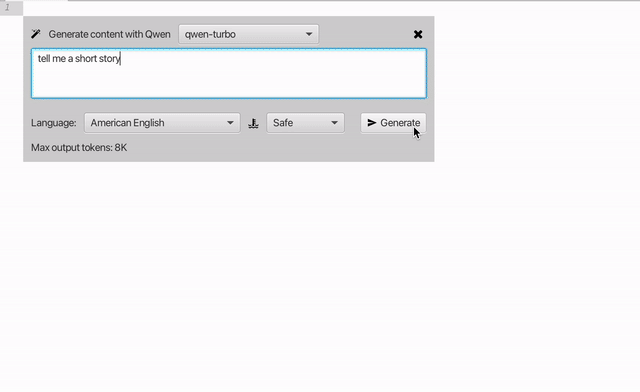
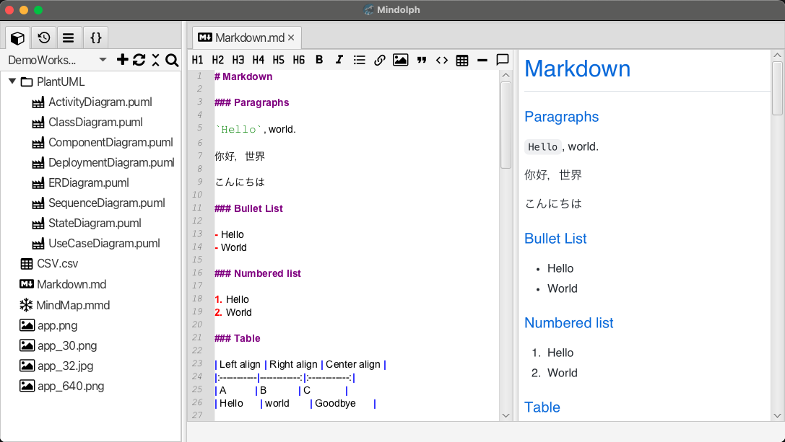
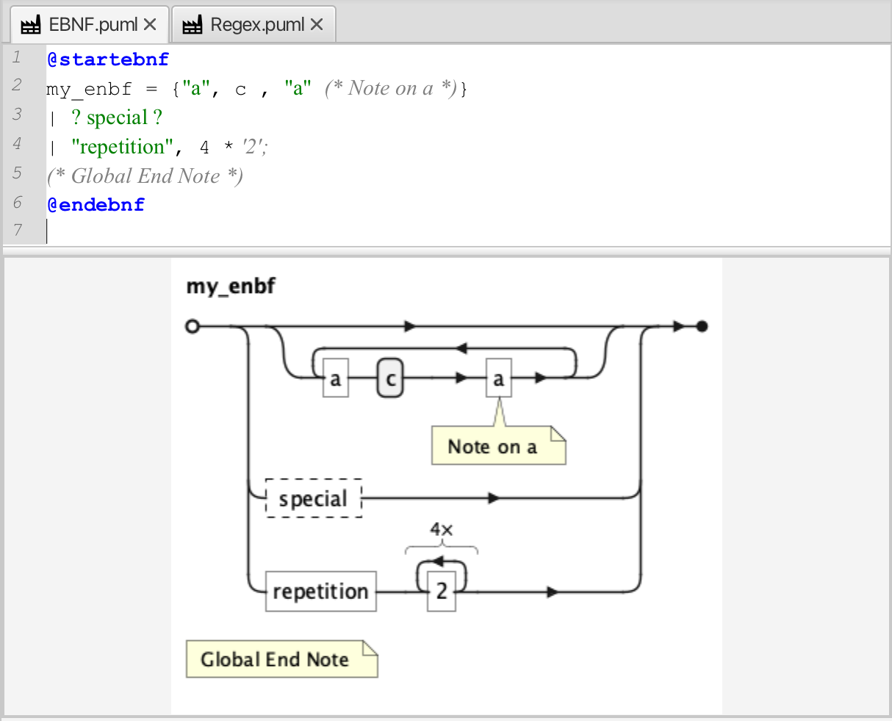
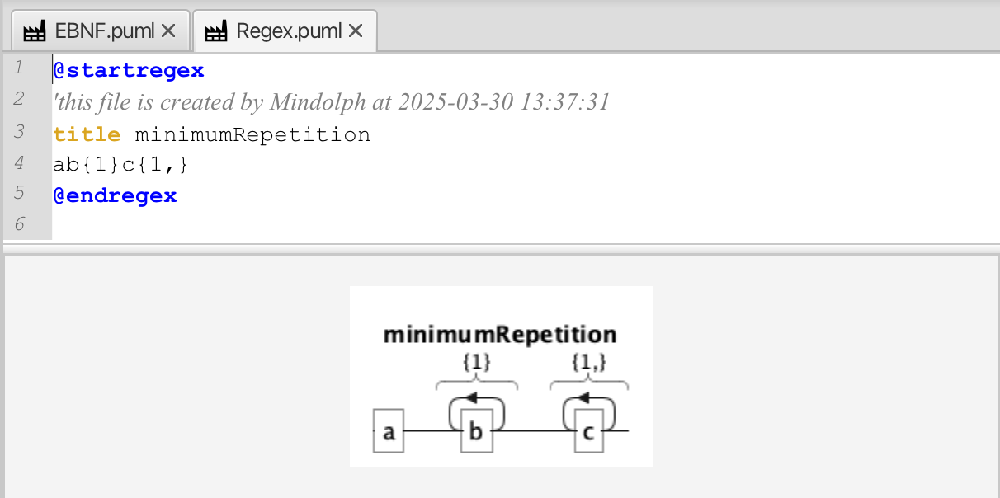

# v1.11 Release Note

### New Features

* Gen-AI  
  

	* Support streaming text generation (supports Markdown, PlantUML, Text file).

	* New Summarize feature to summarize selected text (supports Mind Map, Markdown, PlantUML and Text file).

	* Allow user to setup output language, and also provide an option to make the language of generated content consistent with the language of the text entered by the user.

	* Redesign popup panels to let user select model and output language just before starting generating.

	* Add new support for LLM provider DeepSeek.

* Add new options `UI font size` and `UI icon size` to set  the size of UI font and icons globally, there are three grades of icon size: small (16), medium (20), large (24), these two options need to restart the application to take effect.  
  

* Add Regex and EBNF support to PlantUML  editor.
  
  

### Improvement

* Gen-AI

	* Optimized the handling of user-initiated stop during Gen-AI generation.

	* Temporarily disable the editor during Gen-AI generation to avoid unexpected situations.

	* Remember the latest user input prompt for initializing the prompt of Gen-AI input panel. 

	* Allow user to define multiple custom LLM models.

	* Add a max output tokens parameter to both pre-defined LLM models or custom models to maximize the capabilities of models.

	* Update Qwen, OpenAI and Google Gemini models;

* Add notification for creating new collection for opened files, and add the number of files in the notification message when saving a collection.  

* For applying snippet, automatically wrap up the selected text if the snippet you choose requires that.

* Optimize the topic tree dialog escaping in mind map editor and the search bar escaping.   

* Minor UI improvement.

### Bug Fixes

* When reducing the width of the left sidebar by mouse dragging, the scroll bar of the snippet view will be obscured.  

* The selected default collection is not recovered the selection state on application startup.  

* Filtering snippets should be case insensitive.  

* minor issues for PlantUML templates.   

### Dependencies

* Update PlantUML, commons-csv and other dependencies to the latest version.

---
> Created at 2025-01-25 10:53:44
