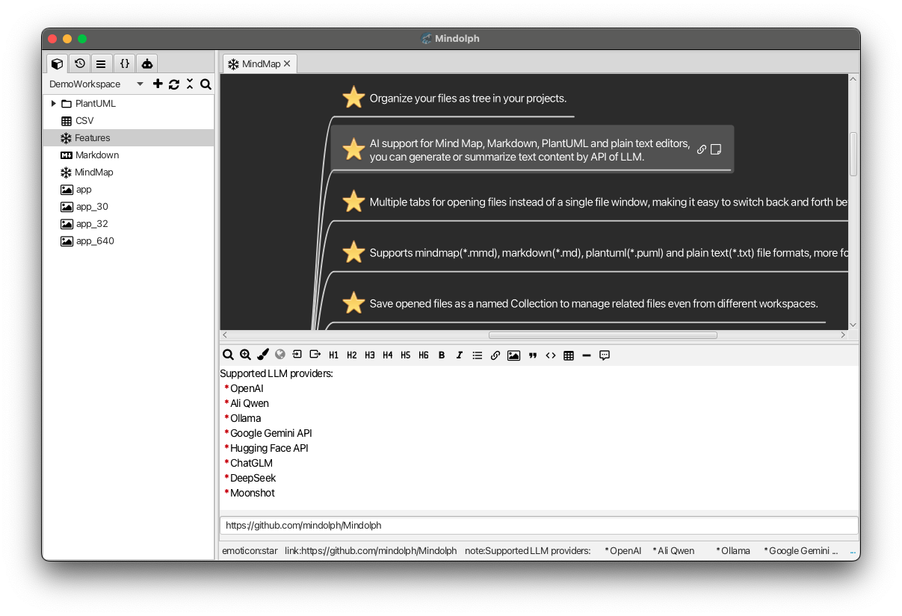
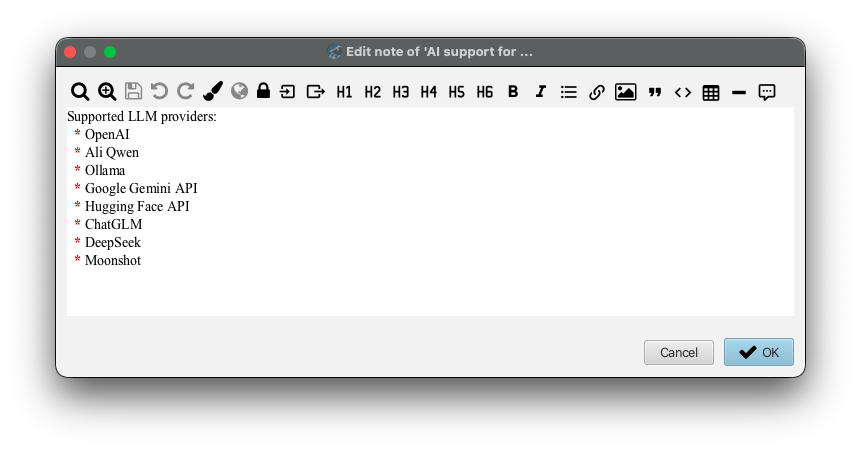
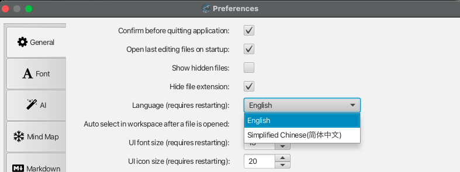

# v1.4发行说明

### 新功能

* 思维导图
	* 为思维导图的主题节点增加属性面板，可以在浏览思维导图的时候快速的读取和编辑笔记和URI。属性面板可以设置位横向或者纵向展示。
  

	* 重新设计了笔记编辑对话框的工具栏按钮，把原来多种样式的按钮统一成小图标按钮。
  

* 国际化支持
	* 增加国际化多语言的特性。
	* 目前支持英语和简体中文。

	  

### 改进

* 默认关闭AI模型的思维模式。

* 更新 OpenAI 模型: `gpt-5.5`, `gpt-5.5-pro`

* 更新 GLM 模型。

* 更新 Qwen 型号 `qwen3.7-plus`, `qwen3.7-max`, `qwen3.6-flash`, `qwen3.6-plus`, `qwen3.6-27b`。

* 更新 Moonshot 模型 `kimi-k2.6`, `kimi-k2.7-code`。

* 更新 DeepSeek 模型 `deepseek-v4-flash` 和 `deepseek-v4-pro`。

* 移除了 OpenAI、Qwen、Moonshot 和 ChatGLM 的已弃用模型。

* 增加应用启动统计。    

### Bug修复

* 温度参数在 Kimi 模型上受到限制

* Qwen 模型`qwen-flash`的最大输出 token 不正确。

* 当未选择嵌入存储类型时，应禁用“测试连接”按钮。

* 检查更新功能有潜在错误的可能.

### 依赖升级

* 更新 JavaFX 至 25.0.3 和其他依赖。

---
> Created at 2026-04-05 10:46:03
