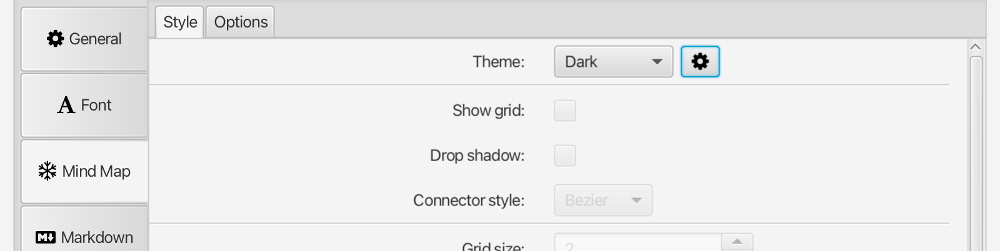
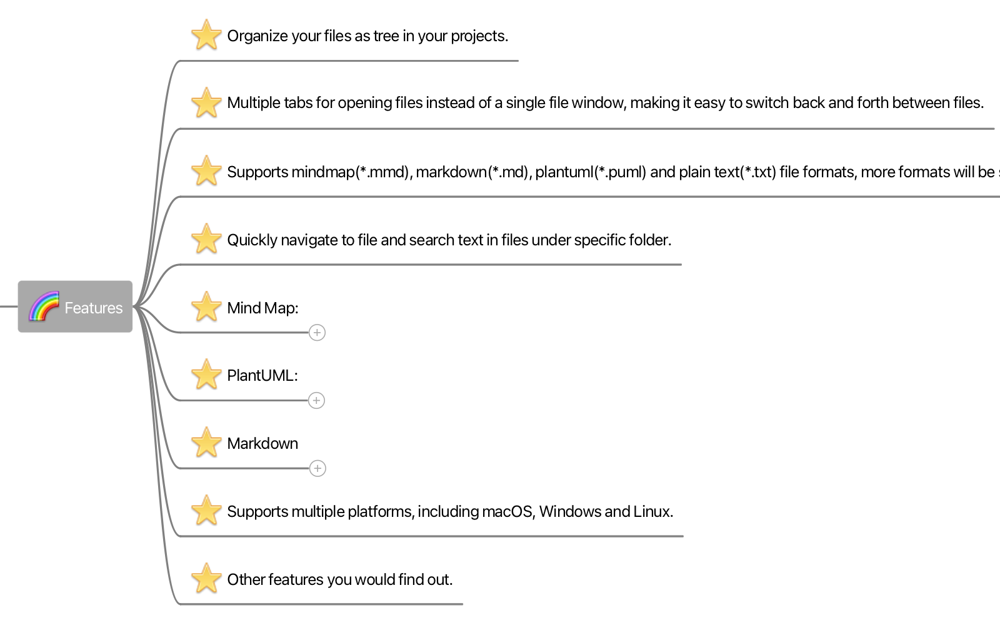
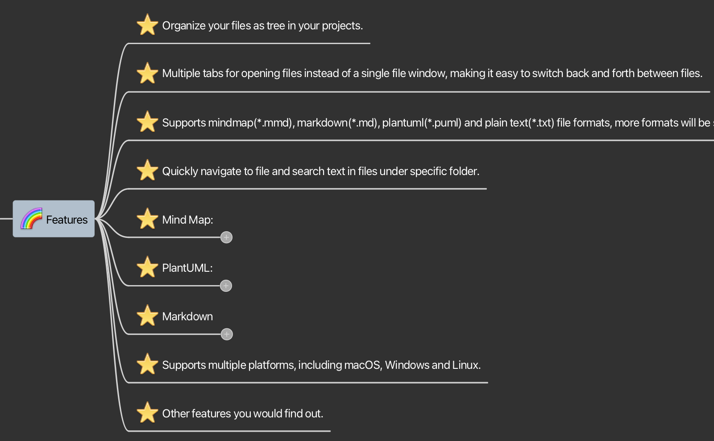
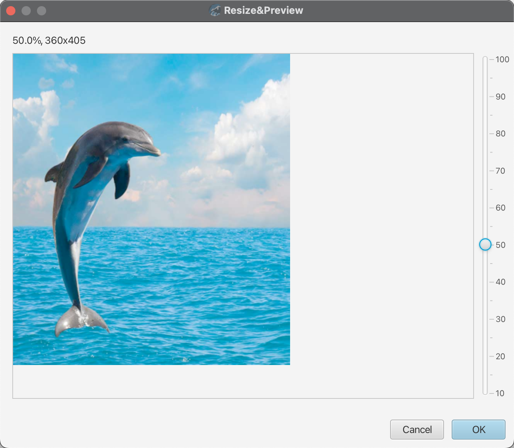

# V1.5 Release Note

### New Features

* Theme Support for Mind Map

As of 1.5, the mind map editor now supports themes. Two new pre-defined themes `Light` and `Dark` are introduced, the old style has now become `Classic` theme. You can also custom your own theme by copying any existing theme(either pre-defined or custom).  
If you newly installed v1.5, the default Theme is `Light`; If you upgrad from an old version, a new custom theme called `default` will be created automatically with your previous style preferences.   
The style of connectors between topics now can choose new `Bezier` style or the classic `Polyline`(the only style in previous version), which can enhance the look of a mind map.
In the new version, the topic connector line is able to choose between the new `Bezier` style or the classic `Polyline` style, which can make mind maps look much better.

	* Light Theme  
	
	* Dark Theme  
	

* Mind Map Embedded Image Preview and Resizing  

	A new preview and resizing dialog has been added for inserting images to mind map topics from clipboard or disk. You can scale image to the appropriate size for mind map topic. Once you have inserted the scaled image to a mind map, it can't be edited and resized again.

	

### Improvement

* General
	* optimize the logger performance.
	* add migration process for data that needs to be fixed when version update.
	* optimized recent list view a little bit.
	* use new icon for 'collapse folder'.
* Mind Map
	* optimized quality of embedded image in topic.
	* let the color dialog be affected by the theme's border type.
	* support converting multi selected topics to the note of their mutual parent.
	* add new preference option for creating default comment to the root node.
	* add spacing between topic extra icons.
	* automatically select the root topic when opening the mind map.
	* optimize the performance of text drawing in mind map.
	* use selected text in input box instead of the first selected topic as a default search keyword.

### Bug Fix

* the installer is unable to launch on macOS 14 Sonoma.
* the new created folder shouldn't appear in the recent files view.
* the toolbar buttons insert redundant symbols to the head of empty lines while multi-line selections.
* mouse hover detection doesn't work well for the last bottom node in the mind map tree.
* file extension be added to the Markdown doc title, which is not appropriate and makes an unnecessary file link to itself.
* the new created file name extension is missing if inputted name contains dots(.)
* exporting markdown to PDF doesn't work.

### Dependencies Update

* update plantuml and richtextfx to latest version.
* bundled JRE upgrade to 20.0.2

---
> Created at 2023-11-08 00:25:06
