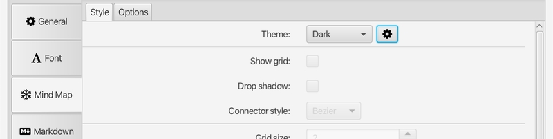
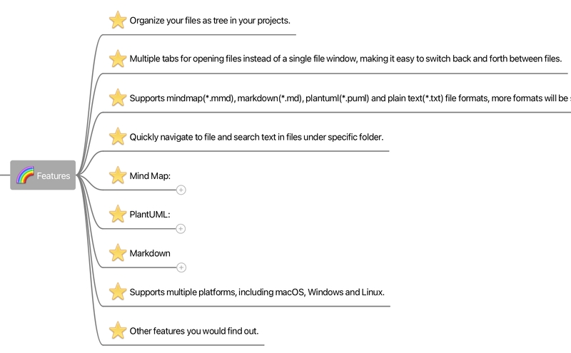
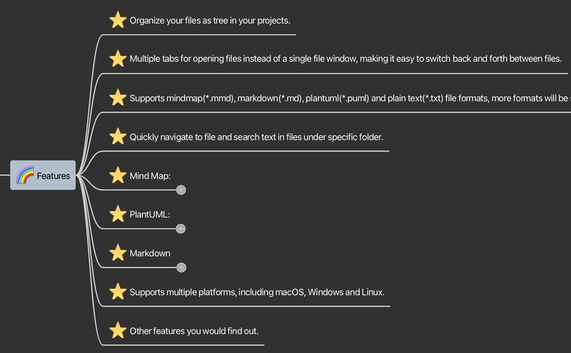
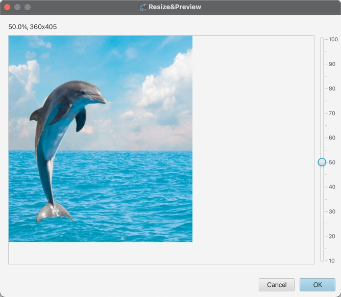

# V1.5 Release Note

### 新功能

* 思维导图主题  
  
从 v1.5 开始，思维导图编辑器的样式支持主题选择，并引入了两个预定义的主题 `Light` 和 `Dark`，原来的样式成为了 `Classic` 主题。您也可以通过复制已经存在的（预定义的或自定义的）主题来自定义主题。   
如果是全新安装 v1.5 版本，默认的主题是 `Light`，如果是从旧版本升级的，那么会按照之前设置的样式自动创建一个名为 `default` 的主题。  
思维导图标题之间的连接线样式可以选择 `Bezier`（贝塞尔曲线）或`Polyline`，可以更美观。

	* `Light` 主题  

	
	* `Dark` 主题  

	

* 思维导图内嵌图片的预览和缩放  

	新增预览和缩放图片的对话框，您可以将嵌入思维导图中的图片缩放至合适的大小。（注意一旦缩放后的图片被插入到思维导图里，它就不能被再次编辑和缩放了。）

	

### 改进

* 通用  
	* 优化了日志的性能。
	* 为程序版本更新可能产生的数据移植增加了处理逻辑。
	* 优化了 `Recent Files` 的 UI 显示。
	* 工作空间工具栏的 `Collapse Folder` 按钮采用新图标。

* 思维导图  
	* 优化了内嵌图片的显示质量，显示图片不再模糊。
	* 主题的标题边框类型不同时颜色对话框能设定的颜色也随之不同。
	* 支持将多个选中的标题内容合并成为它们共同父标题的注释（Note）。
	* 新增选项设置是否要在文件创建的时候为根结点自动添加注释。
	* 标题的图标之间增加间隔距离。
	* 打开思维导图文件时自动选中根结点。
	* 优化导图中文字的渲染性能。
	* 当文字输入框显示时进行搜索，默认使用输入框中选中的文字内容而不是整个标题的文字内容来作为搜索关键字。

### Bug修复  

* macOS 14 Sonoma 上安装器不能正常启动。
* 新创建的目录不应该出现在`Recent Files`里。
* 如果输入的新文件名中包含点（`.`），这个文件就会没有扩展名。
* 思维导图中最后一个底部节点的鼠标悬浮处理不正常。
* markdown 工具栏的 `Bullet List` 和 `Quote` 会在选中多行的情况下在空行中插入多余的字符。
* markdown 导出成 PDF 不能工作。
* 自动添加到 markdown 文档标题的扩展名 `.md` 会产生一个不必要的文件链接。

### 依赖升级  

* 更新 plantuml 和 richtextfx 的版本.
* 绑定的 JRE 版本升级到 20.0.2

---
> Created at 2023-12-12 21:25:06
