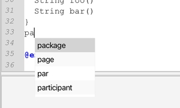
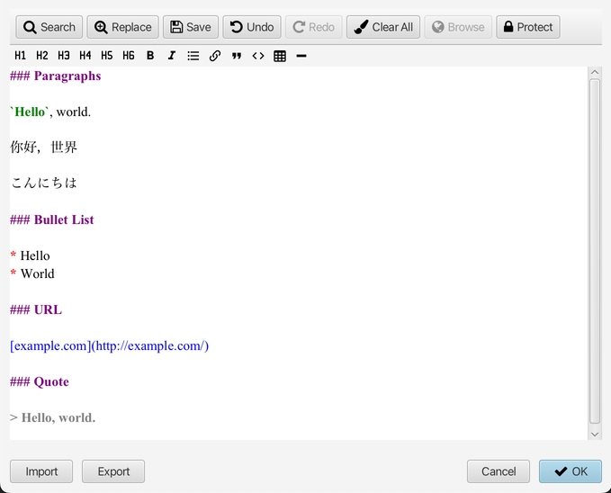

# V1.6 发行说明

### 新功能

* 实现了代码编辑器的输入助手，它从编辑器的内容中收集单词（仅限英语）作为加速输入的建议。 对于 PlantUML，语法关键字也在建议列表中。

	
	> 如果您不想使用此功能，则提供了一个新的首选项来切换输入助手。

* 思维导图中的注释编辑器支持 Markdown 格式。
	

* 支持苹果芯片的 `macOS` 系统的新安装程序。

### 改进

* 添加默认注释到新文件。
* 将长文本粘贴到代码编辑器的性能。
* 优化 Markdown 工具栏的快速插入。
* 优化从代码编辑器中的工具栏或快捷方式快速插入后的选中内容。
* 在 Markdown 工具栏添加水平线按钮。
* 在图像查看器中显示图像分辨率。
* 工作区上下文菜单新增打开菜单项。
* 最近文件列表视图增加上下文菜单。
* 使用可清除的文本输入框进行关键字输入。
* 放大思维导图的画布边缘。

### Bug修复

* 在某些情况下，Markdown 工具栏 `Link` 按钮插入了`Null` 。
* 关闭所有打开但从未加载的 markdown 或 plantuml 文件的选项卡时出现异常。
* 当 plantuml 存在语法错误时，单击状态栏错误时出现异常。
* 在代码编辑器中没有文本选择的情况下快速插入 Markdown 代码引用时的错误行为。
* 删除构建选项 `jdk.gtk.version` 因为 JavaFX 21 不再支持 GTK 2。
* 异常对话框中的文本区域即使内容超出也没有滚动条。
* 从文件导入图像到思维导图后创建文件链接的对话框应该是`是/否`按钮模式，而不是`确定/取消`模式。
* 将文件另存为具有相同路径的新文件时出现异常。
* 缺少 `.jpeg` 文件类型支持。
* 将某些特定缩进文本复制并粘贴到思维导图主题时出现异常。
* 在思维导图中撤消编辑后，根节点的选择处理不正确。
* 从思维导图复制选中节点的文本内容最后带有多余的换行。
* 在M芯片的 macOS 上编辑器没有正确的处理换行 `CRLF` 。

### 依赖项更新

* 将JavaFX更新到21.0.2，其他依赖项包括plantuml、slf4j等。
* 捆绑 JRE 更新至 21.0.2

---
> Created at 2024-02-14 14:20:28
