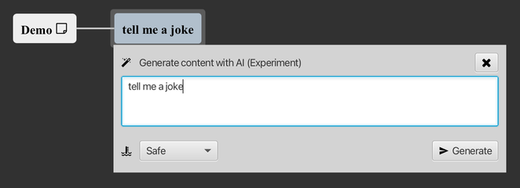
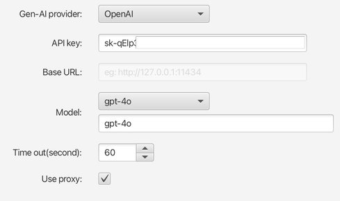
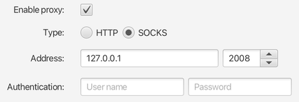

# v1.7.x Release Note

### New Features

* new experimental support for Gen-AI, you can now generate text content by API of LLM in mind map, Markdown editor and PlantUML editor.

	  

	  

	> you need to setup your own API key(for public API like OpenAI) or base URL(for private LLM instance like Ollama) to use. base on your country, some providers might need proxy to access.  

	  

	> Supported LLM models:
	> 	* OpenAI  
	> 	* Ali Qwen  
	> 	* Ollama  
	> 	* Google Gemini API  
	> 	* Hugging Face API  
	> 	* ChatGLM  

* proxy support for internet access, you can setup HTTP or SOCKS5 proxy to be used for API of Gen-AI provider.

	  

### Improvement

* in workspace tree view, nodes can be multiple selected. selected files can be opened in batch, selected files or empty folders can be deleted in batch.

* preference migration implementation.

### Bug Fixes

* the background of mind map doesn't always render correctly when maximize&recover the editor by double-clicking tab of opened file. 

* in Mind Map, the protected topic note can't be opened by password.   

* in Mind Map, after canceling the setting password dialog for topic note, a password reset dialog appears.  

* after a new file/folder created under a folder, the folder itself should not be selected automatically.

* blank text can't be replaced by search&replace in code area.

* `select in workspace` does not clear the previous selection state before file is located.

---
> Created at 2024-02-11 17:43:18
