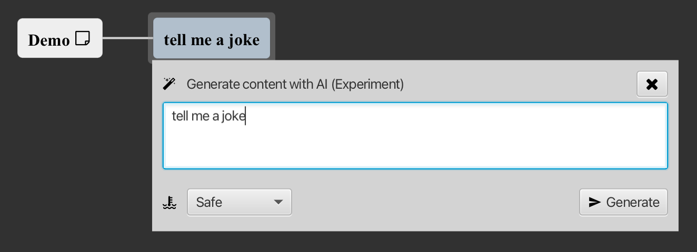
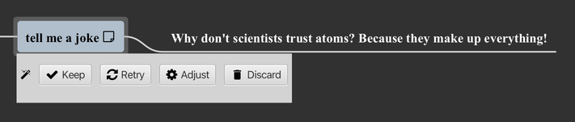
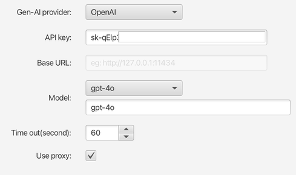
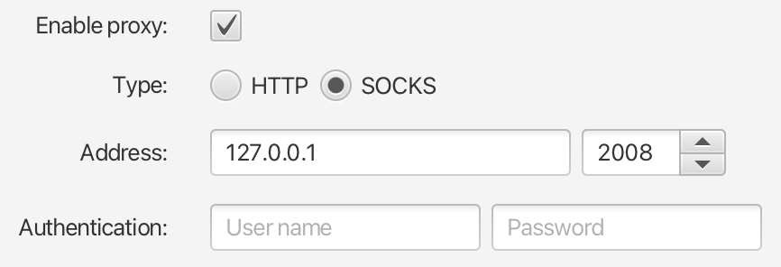

# v1.7 发行说明

### 新功能

* 实验性的 Gen-AI 支持，你可以通过大模型的 API 来生成文本内容，支持思维导图, Markdown 和 PlantUML 编辑器.

	  

	 

	> 你需要设置你自己的 API 密钥(类似 OpenAI 这样的公共API) 或者URL地址(类似 Ollama 的私有 LLM) 。基于您所在的国家，有些模型API可能需要通过代理才能访问。  

	  

	> 	支持的大语言模型列表:  
	> 	* OpenAI  
	> 	* 阿里通义千问  
	> 	* Ollama  
	> 	* Google Gemini API  
	> 	* Hugging Face API  
	> 	* ChatGLM  

* 支持互联网访问代理，你可以通过设置 HTTP 或者 SOCKS5 代理来访问 Gen-AI 模型的 API。

	  

### 优化和改进

* 在工作空间中文件树中可以多选节点，被选中的文件同时打开，被选中的文件或空文件夹可以批量删除。

* 设置选项移植功能的实现。

* 优化 Markdown, PlantUML 和纯文本编辑器内搜索到达底部或者顶部的效果。

### Bug修复

* 当双击思维导图编辑器标签最大化并恢复的时候，思维导图的背景有时候不能正常渲染。

* 思维导图中的锁定主题无法通过输入密码打开。   

* 思维导图中的设置密码对话框打开后如果选择取消，会跳出一个密码重设对话框。

* 在一个文件夹下面创建一个文件/文件夹之后，这个文件夹不应该被自动选中。

* 代码编辑器中的查找&替换功能无法替换不可见字符串。

* `在工作空间中选择`功能定位到文件后没有清除之前的文件选中状态。

* 切换到一个已经不存在工作空间没有任何相应。

* 当Markdown视图模式从`text only` 切换到 `both` 时预览界面没有刷新。

* 思维导图中搜索到折叠的节点时没有展开并获得焦点。

---
> Created at 2024-02-15 13:45:32
