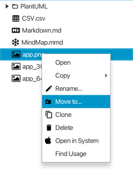
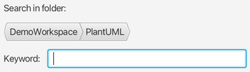

# v1.8 Release Note

### New Features:

* allows exporting selected topics (with or without attributes) as a new file as Mind Map, Markdown, AsciiDoc or structured plain text. 

* copy&paste image from clipboard to selected topics directly by shortcut.  

* Allow dragging external files to any folder in workspace to copy those files.  

* add new preference for automatically selecting in workspace after a file is opened.  

* add `Move to` functionality to the workspace view, allowing users to move selected files to the target workspace/folder that is selected by a popup dialog.

  

  

### Improvement:

* Text in Markdown editor and PlantUML editor can be set different font between descriptive content and code.  

  

  

* Optimize preference dialog.

* Remembers the last active tab and switches back to it when opening the preferences dialog (until the application is killed).

* optimized the PDF exported for markdown files;

* support the CJK characters in code blocks within exported PDF file from markdown.
	> Need to setup the CJK font files for either sans-serif and mono.

  

* allow to select any parent folder in `Find in files` and it's result panel.

  

  

* add new `folder` button to filter folders in `Go to file` dialog

  

* Improved the user interface for file type options in `Go to file` and `Search in file` dialogs using icon buttons.

  

* add blank tail to markdown bullet list.

* automatically expands node in workspace when dragging any file/folder over it.

* improved app menu and context menu displaying.

* optimized button text in confirm dialogs.

* optimized the scroll sync for markdown editor.

* auto select moved files by drag&drop.

### Bug Fixes:

* blank chars are not in correct font before comment line/block in PlantUML.

* unable to open file link with CJK characters.

* wrong redundant highlighting of '#' in non-header text in Markdown file.

* in Mind Map editor, moving any selected topics by shortcut out of viewport doesn't trigger automatically scrolling.

* Emphasis text doesn't work in markdown preview.

* external folder should not be able to drag&drop to workspace.

* blank text can't be replaced by search&replace in code area.

* unexpected refresh in active editor when shortcuts key reference dialog popup.  

* selected file disappear in workspace tree after failed to drag&drop to another folder with same name file exists.

### Others

* A few of refactoring especially for Mind Map.  

---
> Created at 2024-05-22 01:11:19
