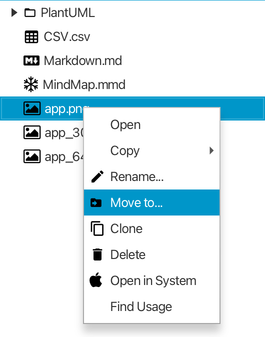
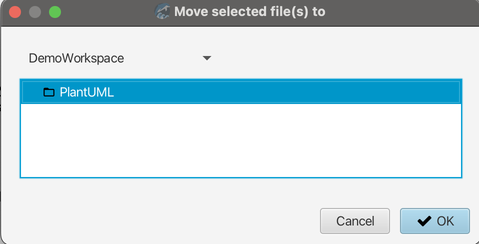
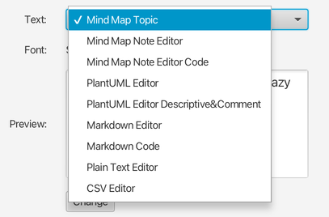
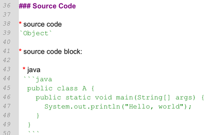
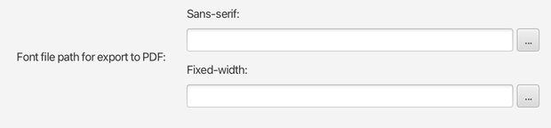
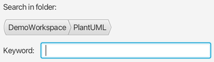
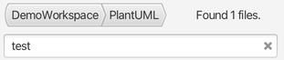

# v1.8 发行说明

### 新功能

* 允许将选定的主题（可选择是否包括属性）导出为思维导图、Markdown、AsciiDoc 或结构化纯文本文件。  

* 通过快捷键直接将剪贴板中的图像复制粘贴到选定主题。  

* 允许将外部文件拖拽到工作区中的任何文件夹以复制这些文件。  

* 添加新首选项，以便在打开文件后自动在工作区中选中它。  

* 添加`Move to`功能到工作区视图，允许用户移动选中的文件到从对话框中选择的工作区/目录中去。  

  

  

### 改进

* Markdown 或 PlantUML 中的描述性内容和代码可以设置为不同的字体 。

  

  

* 优化用户设置对话框。

* 记住所打开的最后一个活动标签页，并在打开首选项对话框时切换回该标签页（直到应用程序退出）。  

* 优化了 Markdown 文件导出的 PDF。  

* 支持导出 PDF 文件时，代码块中的 CJK 字符 (中日韩字符)。  
	> 需要设置无衬线和等宽的CJK字体。

  

* 允许在`Find in files`及其结果面板中选择任何父文件夹。  

  

  

* 在`Go to file`对话框中添加新的`Folder`按钮以过滤文件夹  

  

* 使用图标按钮改进了`Go to file`和`Search in file`对话框中文件类型选项的用户界面。  

  

* 添加空尾到 Markdown 项目符号列表。  

* 在将任何文件/文件夹拖到工作区节点上时自动展开该节点。  

* 改进了应用程序菜单和上下文菜单的显示。  

* 优化了确认对话框中的按钮文本。  

* 优化了 Markdown 编辑器的滚动同步。

* 自动选中被拖放后移动的文件。

### Bug修复

* 思维导图中通过快捷键移动选中的主题节点至视图范围之外没有触发视图自动滚动。

* 强调文本在 Markdown 预览中不起作用。  

* 外部文件夹不应该能够拖放到工作区。  

* 空文本无法通过代码区域中的搜索替换进行替换。  

* 快捷键参考对话框弹出时使得当前的编辑器强行刷新。

* 当拖放文件至拥有同名文件的文件夹失败之后，被选中的文件从工作空间消失了。

### 其他

* 一些重构，尤其是针对思维导图。  

---
> Created at 2024-05-22 01:11:28
