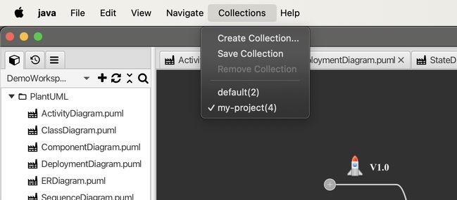
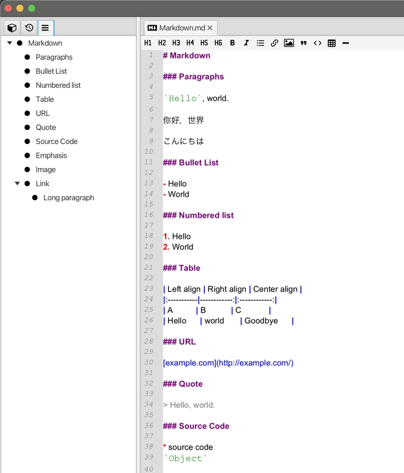
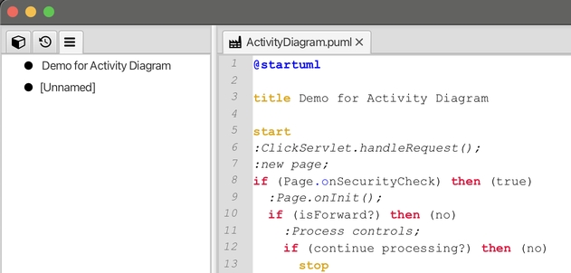

# v1.9 Release Note

### New Features

* New file collections functionality that lets you save opened files as a named collection and switch between different collections. 

	  

	* a default collection names `default` will be created automatically, if your installation is upgraded from older versions, the last opened files list will be saved to the `default` collection.

* New outline view to outline the content for Mind map, Markdown and PlantUML files. 

	* Mind Map
	  

	* Markdown
	  

	* PlantUML
	  

### Improvement

* The displaying of tabs on the left side panel is minimized since the outline view is introduced.

* Center the caret in the view-port after locating to any paragraph in code editor.

* Add image quick insert button to the toolbar to Markdown code editor.  

### Bug Fixes

* exception when undo editing from an empty row in CSV editor.

* clicking on web links in markdown preview panel should go to external browser.

### Dependencies

* update bundled JRE to 22.0.2  

* update JavaFX to 23.0.1 and update other dependencies.

---
> Created at 2024-08-18 00:32:26
