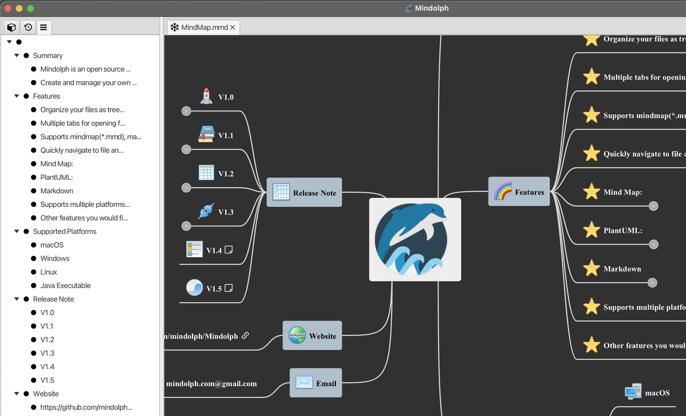

# v1.9 发行说明

### 新功能

* 新的文件集合功能可让您将打开的文件保存为命名集合，并在不同集合之间切换。

	  

	* 一个名为`default`的默认集合将被自动创建，如果您的安装是从旧版本升级的，最后打开的文件列表将保存到`default`集合中。

* 为思维导图、Markdown 和 PlantUML文件新增大纲视图。

	* Mind Map
	  

	* Markdown
	  

	* PlantUML
	  

### 改进

* 因为大纲视图的引入，把左侧栏的标签最小化。

* 代码编辑器定位后的光标使其在可视区域内居中。

* 为Markdown代码编辑器增加插入图片快捷按钮。

### Bug修复

* 在CSV编辑器中从一个空行撤销编辑时出现异常。

* 点击Markdown预览中出现的网址链接应当跳转到外部浏览器打开。

### 依赖升级

* 捆绑的 JRE 升级到 22.0.2  

* JavaFX 升级到 23.0.1 以及其他依赖升级到最新版本

---
> Created at 2024-08-18 00:32:36
