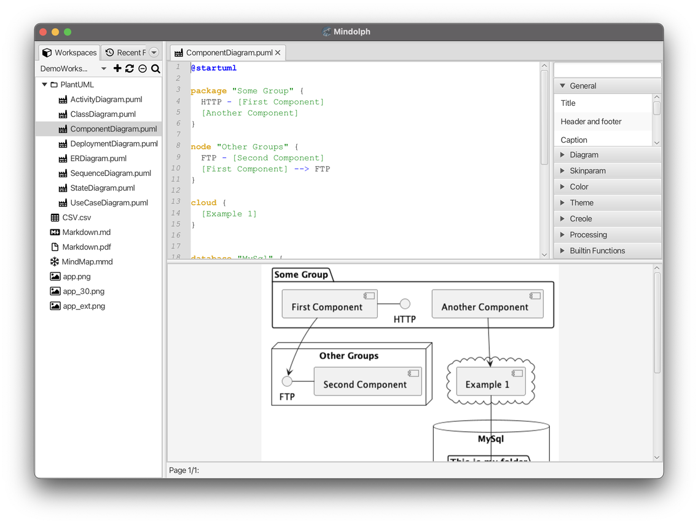
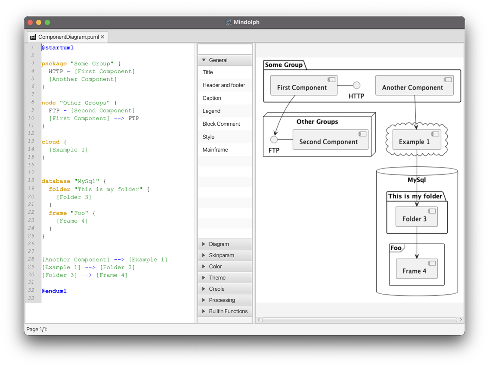
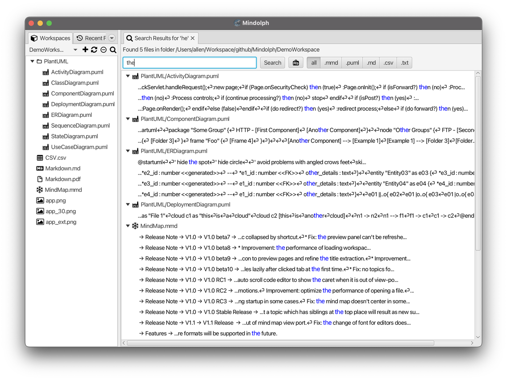

# screenshots

* Mind map in light mode

* Mind map in dark mode

* Mind map in classic mode

* Markdown edit and preview

* Markdown edit and preview

* PlantUML activity diagram

* PlantUML class diagram

* PlantUML component diagram

* PlantUML component diagram

* PlantUML sequence diagram

* PlantUML state diagram

* PlantUML usecase diagram

* Find in files by keyword

